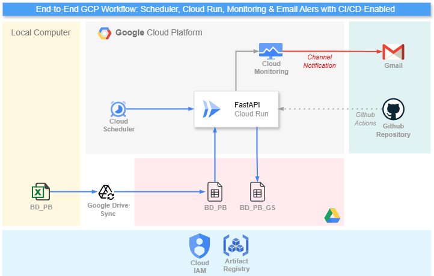

# Sheets Automations Clinica Versalles - Backend

## 📌 Overview

This project is a backend service built with **FastAPI** designed to automate interactions with Google Drive and Google Sheets. Its primary function is to convert and upload Excel (`.xlsx`) files to existing Google Sheets, providing a seamless bridge between local/legacy data formats and cloud-based spreadsheets.



## 🎯 Objectives

-   **Automate Conversion:** Efficiently read Excel files from Google Drive and convert them to Google Sheets format.
-   **Selective Processing:** Allow users to specify exactly which tabs to copy from the source file.
-   **Data Integrity:** Ensure reliable data transfer with options to wipe target sheets before writing.
-   **Scalability:** Handle large datasets and Google API rate limits through chunking and retry logic.
-   **Automated Deployment:** streamline updates and management via CI/CD pipelines.

---

## 🛠️ Technologies & Tools

-   **FastAPI** – High-performance web framework for building APIs.
-   **Google Drive API** – For accessing and downloading Excel files.
-   **Google Sheets API** – For reading, clearing, and writing data to spreadsheets.
-   **Docker** – Containerization for consistent development and deployment environments.
-   **Docker Compose** – Tool for defining and running multi-container Docker applications.
-   **GitHub Actions** – For CI/CD pipelines to automate deployment to Google Cloud Platform (GCP).

**Prerequisites:**
*   **GCP Service Account** with `Google Drive API` and `Google Sheets API` enabled.
*   **Credentials:** A `gcp.json` key file for the Service Account.

---

## 🔄 Project Workflow

1.  **Request Initiation:**
    -   The user sends a POST request to the API with the source Excel file ID and target Google Sheet ID.

2.  **File Retrieval:**
    -   The service authenticates with Google Drive and downloads the specified `.xlsx` file.

3.  **Data Processing:**
    -   The application parses the Excel file, extracting data from the selected tabs.
    -   If `wipe_mode` is enabled, the target sheets are cleared.

4.  **Data Upload:**
    -   Data is uploaded to the target Google Sheet in chunks to respect API limits and ensure stability.

5.  **Deployment (CI/CD):**
    -   Changes pushed to the `main` branch trigger the automated deployment pipeline.
    -   The pipeline sets up the environment, authenticates with GCP, and deploys the updated service.

---

## 🚀 CI/CD Pipeline

The project utilizes **GitHub Actions** for Continuous Integration and Continuous Deployment (CI/CD) to Google Cloud Platform. The workflow is defined in `.github/workflows/gcp-deploy.yml`.

### Triggers
-   **Push to `main`:** Automatically triggers deployment when changes differ in the `app/` directory.
-   **Manual Dispatch:** Allows manual triggering of `deploy` or `destroy` operations via the GitHub Actions UI.

### Workflow Steps
1.  **Setup Environment:**
    -   Checks out the code.
    -   Generates necessary configuration files (`conn/`) from GitHub Secrets.
2.  **Deploy/Destroy:**
    -   Authenticates to Google Cloud using OIDC.
    -   Executes `scripts/deploy.sh` to deploy the backend or `scripts/stop.sh` to destroy it.

### Required Secrets
The following secrets must be configured in the GitHub repository:
-   `ENV_FILE`: Content of the `.env` file.
-   `BACK_ENV_FILE`: Content of the `back.env` file.
-   `GCP_CREDENTIALS_JSON`: The Service Account JSON key.

---

## 📊 API Documentation

### Health Check
*   **Endpoint:** `GET /`
*   **Description:** Returns the API welcome message and version.

### Convert XLSX to Existing Sheets
*   **Endpoint:** `POST /convert/xlsx-to-existing-sheets`
*   **Description:** Reads an Excel file from Drive and writes specific tabs to a Google Sheet.
*   **Payload Example:**
    ```json
    {
      "xlsx_file_id": "1a2b3c...",
      "target_spreadsheet_id": "1x2y3z...",
      "selected_tabs": ["Sheet1", "Data"],
      "wipe_mode": "all",
      "value_input_option": "RAW",
      "target_cells_per_request": 80000,
      "max_retries": 8
    }
    ```

---

## 📁 Repository Structure

```text
sheets_backend/
├── .github/              # GitHub Actions workflows
├── app/                  # Application source code
│   ├── main.py           # FastAPI entry point
│   ├── gs.py             # Google Sheets/Drive logic
│   └── config.py         # Configuration
├── conn/                 # Connection credentials (gcp.json)
├── scripts/              # Deployment and utility scripts
├── docker-compose.yml    # Docker services definition
├── Dockerfile            # Docker image build instructions
└── README.md             # Project documentation
```

---

**Note:** Ensure the Service Account email (from `gcp.json`) has **Editor** access to both the source Drive folder/file and the destination Google Sheet.
